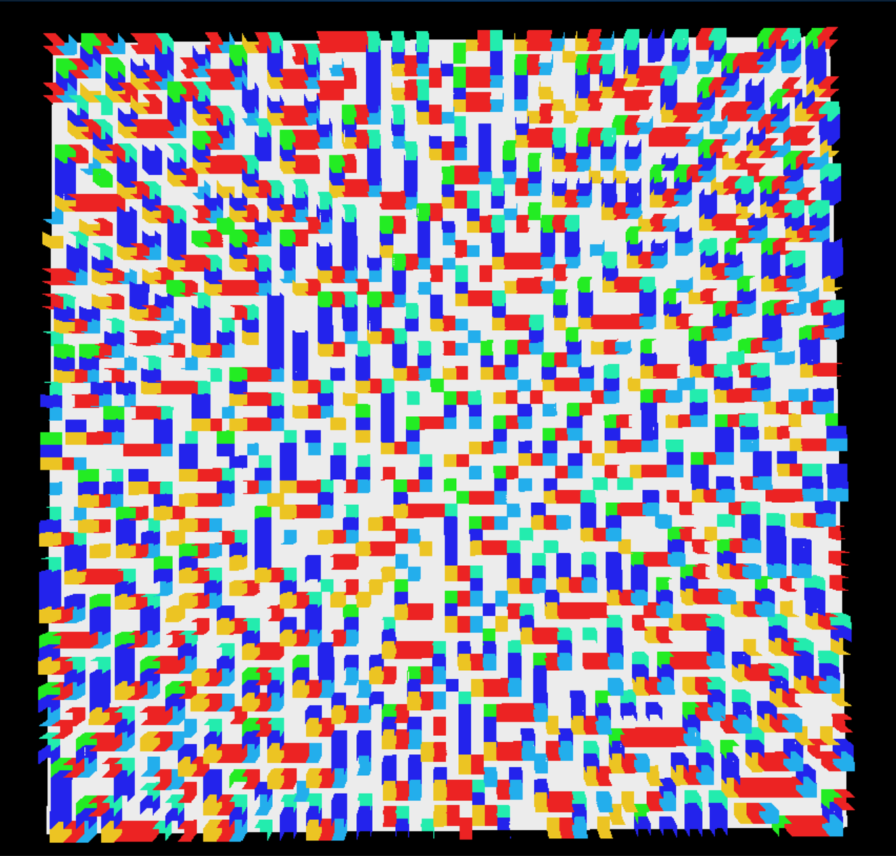
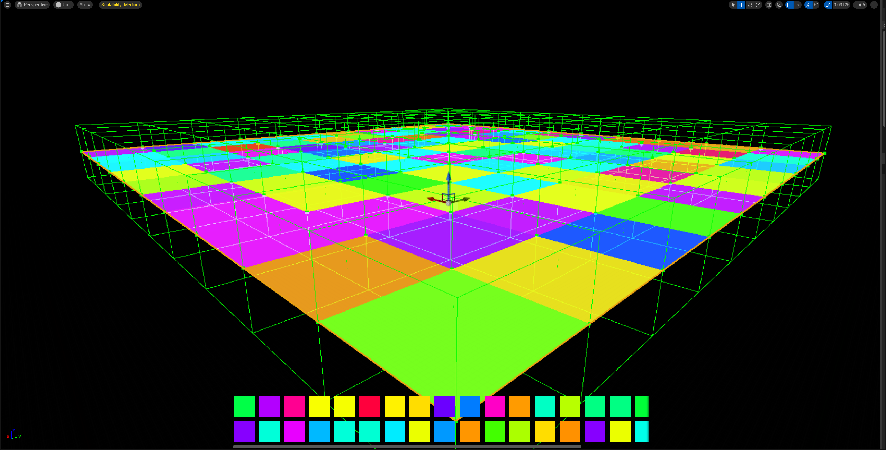
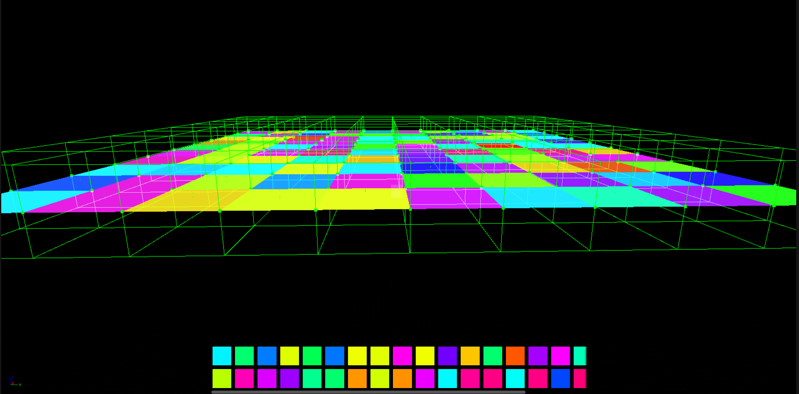

# Procedural Generation
###  !!!! Still Under Development

### This Plugin is part of PorjecctCore V2 [PorjecctCore V2](https://github.com/XyonX/ProjectCoreV2) 

### UI  Is separated to this  plugin :  [CoreUI](https://github.com/XyonX/CoreUI)  
 
# Procedural level generation in unreal engine 

 Algoritm to generate procedural Level using premdade Meshes '
 Uses the concept of Wave Function Collapse 

 
 

## Features

- Base Procedural Actor 
- Debug UI
- Mesh Generation From Code 
- Modular Structure
- Easily expandable 

# Generations

## Random  Generation
- Totally Random
- Has some mesh overlap issue
- Custom probability Not Applied
- 4096 Tiles , 64x64 Grid

## Raw Without Custom Frequency

## Programmed Grid Mesh

## Random  -01

## Random  -02

## Random  -03

## Documentation

[Documentation](https://linktodocumentation)

